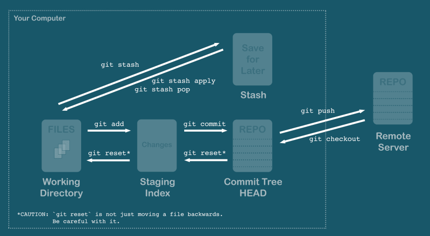

Git - Crash Course
******************

:source: https://dev.to/chrisachard/confused-by-git-here-s-a-git-crash-course-to-fix-that-4cmi?utm_source=digest_mailer&utm_medium=email&utm_campaign=digest_email

NOTE: if you are looking for a very basic intro to git, I recommend reading `this guide<https://www.atlassian.com/git/tutorials/what-is-version-control>` by Atlassian first

1. Git 5 states

* Working directory
* Staging (Index)
* Commit tree (local repo or HEAD)
* Stash
* Remote repo (github, Bitbucket, gitlab, etc)

2. Move bitween the 5 states

* :code:`git add` working dir => staging
* :code:`git commit` staging => HEAD
* :code:`git push` HEAD => remote repo
* :code:`git stash` working dir <=> stash
* :code:`git reset` and git checkout to pull from upstream

