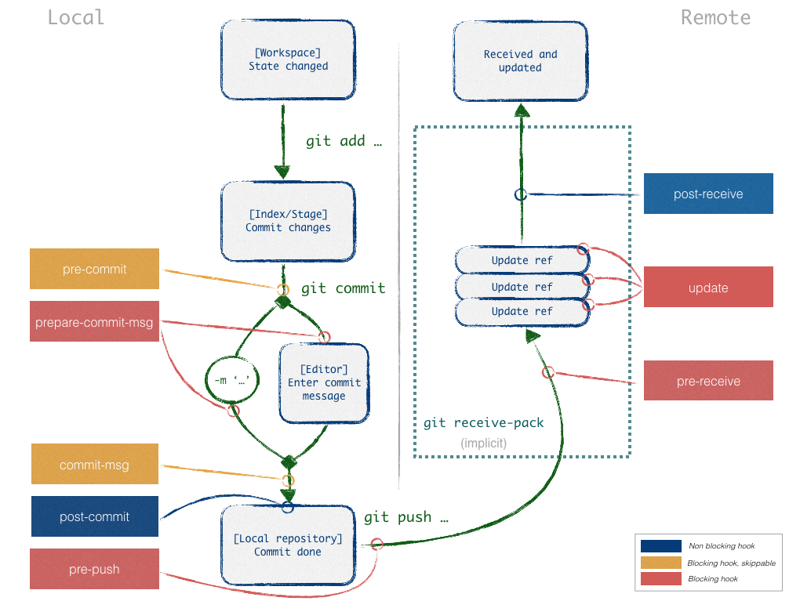

git-hook
########

Def
***

* Default: :code:`<project>/.git/hooks`
* must be executable :code:`chmod +x .git/hooks/<hook_file>`
* local hook is not control, just asist
* can blocked action or not (by convention pre-<command> blocked)
* standart exit
    * 0: ok, don t block
    * >= 1: fail, block

Install Server
**************

#. Pick a project that needs a custom Git hook.
#. On the GitLab server, navigate to the project’s repository directory. For an installation from source the path is usually /home/git/repositories/<group>/<project>.git. For Omnibus installs the path is usually /var/opt/gitlab/git-data/repositories/<group>/<project>.git.
#. Create a new directory in this location called custom_hooks.
#. Inside the new custom_hooks directory, create a file with a name matching the hook type. For a pre-receive hook the file name should be pre-receive with no extension.
#. Make the hook file executable and make sure it’s owned by git.
#. Write the code to make the Git hook function as expected. Hooks can be in any language. Ensure the ‘shebang’ at the top properly reflects the language type. For example, if the script is in Ruby the shebang will probably be #!/usr/bin/env ruby.

Hook list
*********

commit:

* pre-commit
* prepare-commit-msg (server)(blocking)
* commit-msg
* post-commit

patch (git am):

* applypatch-msg
* pre-applypatch (server)(blocking)
* post-applypatch

other:

* post-checkout
* post-merge
* post-rewrite: called by :code:`git commit --amend, git rebase`
* pre-rebase (server)(blocking)
* pre-push (server)(blocking)
* pre-auto-gc (server)(blocking)

server:

* pre-receive (server)(blocking)
* update (server)(blocking)
* post-update
* post-receive

Example
*******

Post-commit example
===================

.. literalinclude:: ./codes/post-commit

Pre-commit example
===================

.. literalinclude:: ./codes/pre-commit

.. literalinclude:: ./codes/pre-commit1

Todo
****

.. warning::
    Todo
    
    * to_read:
        - https://pre-commit.com/
        - https://githooks.com/
    * sources:
        - https://delicious-insights.com/fr/articles/git-hooks/
        - https://docs.gitlab.com/ee/administration/custom_hooks.html
        - angularjs: https://github.com/conventional-changelog-archived-repos/validate-commit-msg