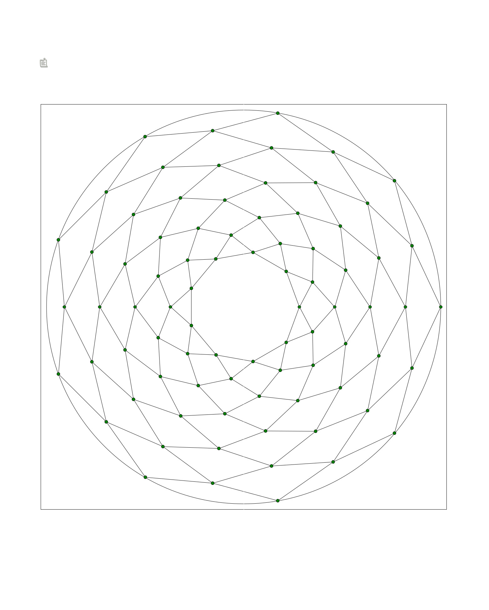

Gogame - Variantes
##################

Atari go
*********

Sur 9x9

Placer un crosscut au centre du goban.

Definir le nombre de pierre que l on souhaite capturer pour remporter la victoire.

Jouer normalement le premier arrive au nombre defini de prisonier gagne.

Blind go
*********

On joue normalement, mais a chaque fois qu on joue une pierre on retire celle que le partenaire vient de jouer. Il est donc necessaire de retenir l ensemble des coups precedents.

Deglingo
********

par R0n1n

A la maniere de l Unicolor. Sauf que les deux premieres pierres sont noires, puis les deux suivantes blanches et ainsi de suite.

Dice go
*******

From Kalyptane (ou un de ses inities je ne sais plus)

Avant de commencer a jouer on decide ce que represente chaque face du de

Par exemple

* 1: passe
* 2: keima
* 3: tobi
* 4: kosumi
* 5: invasion
* 6: nobi

Chaque joueur a sa definition

Jouer une dizaine d echange. puis a chaque coup on jette le des pour savoir ce qu on joue.

Pour compliquer:

* on peut imposer un certain nombre de mauvais coup dans le choix a faire
* on peut obliger d avoir l action de passer dans les choix, et il faut que les deux joueurs passent pour que la partie se finissent

Fantome
********

Le go-fantôme est une variante du go se jouant à deux, et un arbitre.

Les joueurs jouent dos à dos, chacun sur son goban, sans voir les coups de l’adversaire. L’arbitre est chargé de noter la partie sur un troisième goban, d’annoncer les « coups impossibles » (à cause de la présence d’une pierre adverse, de la règle du suicide, d’un ko…) ainsi que les atari et les prises de pierre.

Une partie est généralement jouée sur 9×9. 

* https://play.google.com/store/apps/details?id=de.roland_illig.android.phantomgo
* https://go.kahv.io/ (prevu)

Hunger go
*********

Duree: Grosso modo 2h

2 équipes de 10 joueurs max plus un coatch vont s'affronter !

Un ordre de passage est pré-établi, chacun joue un nombre de coup déterminé.

Pendant qu une personne passe, il n a pas le droit de discuter avec les autres.

A cote de ca, le coatch discute de futures plans avec les autres joueurs.

penser a dire au coatch de destresser les joueurs

Annonce d ouverture
===================

Salut tout le monde l'hunger go est en approche, nous avons besoin de 10 a 20 joueurs pour participer a l affrontement du 21 mai 2021 a 20h.

Qu est ce que l "hunger go" ?

* Une arene de 12 a 22 personnes vont lutter pour leur survie
* 2 equipes de 10 joueurs max plus un coatch vont s'affronter !
* Un ordre de passage est pré-établi, chacun joue un nombre de coup déterminé.
* Pendant qu une personne passe, il n a pas le droit de discuter avec les autres.
* A cote de ca, le coatch discute de futures plans avec les autres membres de l equipe.

Vous voulez participer ? envoyez moi un mp, et puisse le sort vous etre favorable.

Orga
====

Sur Kgs
1 demo, cree par l organisateur, celui ci donnera la main aux joueurs
2 clone, un par coatch

Sur discord, trois salons, un par equipe, un de lancement qui restera ouvert
Les salons d equipe, seul les equipes ont le droit d acces
Lorsqu un joueur passe, il se rend sourd et muet

En debut de jeu les coachs ont 10 min pour determiner l ordre de passage des joueus et le transferer a l orga

Sur la demo orga, quand l orga ecrit STOP les joueurs jouent encore un coup chacun, puis l orga passe aux joueurs suivant.
eviter de jouer un coup en plus de 30 sec

3 jokers par equipe, pour les utiliser, dire JOKER dans le chan kgs (les coatchs sont libres de proposer qui et comment les utiliser).
Attention le joker profite au deux equipes.
lors de l utilisation du joker les joueurs en train de jouer on droit d interagir avec leur equipe pendant 2 min

Merci au spectateur de ne pas ecrire dans les demos

La partie cache de l iceberg
============================

- en avance
  - trouver deux coatch
  - lancer le recrutement au moins 2 semaines en avance
  - faire un rappel a 1 semaine, 3 jours et le jour J
  - s arranger pour avoir les trois vocaux en avance, les verifier avec les 2 coatchs
  - se faire des notes de ce qu il faut presenter lors du lancement
  - verifier que les coatch savent bien utiliser les demos
  - verifier que les joueurs savent bien rejoindre les demos/ont le bon materiel
- jour J
  - rassembler tout les participants dans un salon, + spectateur ?
  - l orga creer la demo de jeu
  - demander aux coatchs de creer les clones
  - preciser de bien lire le chan de communication (que se soit sur kgs ou discord), pour que les messages de l orga soient bien lu
  - laisser 10 min au coach pour 
    - preciser les regles a leur equipe
    - definir une strategie de jeu, et une strategie d utilisation des jokers
    - definir l ordre de passage de joueur (coatch inclus ou non)
  - une fois les 2 ordres de passage defini, donner la main au deux premiers joueurs et c est partie
  - recommendation:
    - avoir sur un blocnote les listes de passage, avec la couleur de chaque joueur
    - la liste doit etre faites des psuedo kgs pour n avoir qu a copier coller
    - avoir les messages sur un bloc note pour n avoir qu a les copier coller ("STOP 2 minutes de pose", "Dernier coup", "joueur suivant s il vous plait", ...)
    - avoir une marque pour savoir quel joueur est en train de passer
    - avoir une marque pour savoir qui est le premier joueur a avoir jouer pendant ce tour
  - a l orga de juger le nombre de coup jouer par les deux joueurs
    - pas trop pour que si un joueur faible tombe sur un joueur fort il ne soit pas trop longtemps en difficulte
    - pas trop peu pour eviter que les joueurs ne face que reciter ce que le coach a montre
    - a titre indicatif au hunger go du 2021.05.22 le nombre de coup cumule des deux joueurs tournaient entre 10 et 20 coups
    - parfoit un nombre impair de coup de maniere a ce que le premier coup soit parfois pour noir, parfois pour blanc lors du changement de jouer
  - quand deux joueurs sont en train de jouer, les prevenirs quand 30 sec sont passe
  - prevenir quand c est le ou les deux derniers coups a jouer
  - quand on demande au joueur de s areter
    - reprendre la main de maniere a ce que les joueurs ne jouent pas des coups en plus
    - lancer le chrono pour ne pas depasser le temps decider pour le passage entre deux joueurs
    - preparer le fait de donner la main au joueur suivant
    - preparer les messages pour demander aux joueurs suivants de se mute
  - 10 sec avant la fin du chrono de passage, envoyer le message pour demander aux joueurs suivants de se mute, de cacher la demo des coachs et de passer sur la demo de l orga
  - quand les 2 joueurs sont mutes, leur donner la main pour qu il puisse jouer

a titre indicatif, hunger go du 2021.05.21 300 coups 2h30 de jeu

JO
***

Theme
* tsumego
* yose
* fuseki
* chuban

Quiz
* qui est le 5e honinbo
* quel est l ouverture prefere de gu li
* qu est ce qu un honinbo honoraire

Vitesse
* aller le plus loin possible en reposant

La strasbourgeoise
*******************

Pio2001 (Guillaume)Hier à 23:31
Salut, la règle strasbourgeoise (ou "stone scoring", en anglais, également équivalent à la notion de "group tax"), c'est celui qui a le plus de pierres sur le goban qui est le gagnant. Il faut donc remplir tous ses territoires jusqu'à ce qu'il n'y ait plus que deux yeux dans chacun. Le score (nombre de pierres) est alors maximal. Cela revient au même que la règle française / chinoise avec "group tax" : on est pénalisé de deux points par groupe vivant (les deux yeux). L'intérêt pédagogique est de faire découvrir pourquoi on passe notre tour à un certain moment. Avec cette règle, on apprend par l'exemple pourquoi l'invasion devient inutile à la fin et pourquoi les espaces vides sont des points pour nous. A moment donné, il devient évident qu'au lieu de tout remplir, on peut faire comme si, et compter les points.

https://strasbourg.jeudego.org/regle_strasbourgeoise.htm

Le go du demineur
*****************

par R0n1n

Deux joueurs et un mineur.

Le mineur place des mines sur le goban sans les annoncers aux joueurs.

il definit pour chaque mine:

* son intersection
* son effet si elle explose
* son effet si elle est desamorce

Ces mines peuvent soient exploser, si une pierres est posee dessus, soient etre desamorces si les libertes de l intersections sont prises.

Si une mines est desamorces elle ne peut plus ni explosee ni etre desamorce de nouveau.

Si une mine explose, elle est toujours active et peux donc toujours re-exploser ou etre desamorce

Les effets sont libres de choix au mineur dans la mesure du raisonable

Exemple

* donne un nombre de pierres gratuites a poser (defini au prealable, ou au hasard grace a un de)
* donne le droit 5 fois dans la partie de repndre un ko directement
* inverse la couleur des pierres de chaque hoshis (les pierres retirer vont dans les bols)
* Donne une liberte invisible au pierre qui ont desamorces la mine (il faudra donner une pierre au partenaire pour pouvoir les capturer)
* tout les 50 coups le joueur est obliger de passer
* etc

Lucky go
*********

Sur 9x9

Prendre dix pierres noires et les mettre dans le bol blanc. Prendre dix pierres blanches et les mettre dans le bol noir.

Pour jouer:

* decider on l on veut jouer
* l indiquer a son partenaire
* prendre une pierre dans son bol sans regarder
* la jouer, qu elle soit noire ou blanche

Plateau spherique
*****************

Play in this kind of goban

Tactigo
=======

Le Tactigo est une variante du Go, dont le but pour blanc est d'avoir un seul groupe vivant, et pour noir de l'en empêcher. Pour l'aider, noir dispose de nombreuses pierres d'avance sur le goban (traditionnellement 17, placées comme sur le modèle 1.)
Le komi est ajusté de telle sorte que Blanc gagne s'il fait un groupe vivant.

Pour jouer, il suffit de charger le SGF du modèle de votre choix ci-dessous , de le télécharger dans la salle SITS de KGS (dans la fenêtre principale de KGS, Fichier>Télécharger un fichier SGF en...>Stones in the Shell)
Ensuite, quand votre adversaire est entré dans la démo, allez dans Outils>Sélectionner les joueurs (en haut à gauche) et d'entrer les pseudos des joueurs.

Tactigo : Variante de la règle du Gâteau (miam)
Vous pouvez varier les pierres noires placées au départ en suivant cette règle:
choisissez le modèle 3, 4 ou 5 (en fonction de la taille souhaitée.) Ensuite, le premier joueur pose un nombre de pierres noires de son choix. Quand il a fini, le deuxième joueur décide s'il souhaite jouer Noir ou Blanc.

Torigo
******

Les bords ne sont plus des bords, la ligne de demarcation droit partage ses libertes avec la ligne de demarcation droit. De meme pour le haut et le bas

https://torigo.io/

Tsuke go
*********

Jouer une dizaine d echange. Puis les coups suivants doivent etre obligatoirement en tsuke (kosumi accepte)

Unicolor
********

Chacun des partenaires a un bol de pierres blanches. Chaque pierre jouer nous appartient. Il est donc necessaire de retenir les coups jouer.

CgobanH
*******

tellecharger cgobanh: http://beijinggoclub.com/cgoban-h.jar
version hack de cgoban, attention il est interdit de se faire attraper sinon c est le ban

Puis pour passer en blindgo ecrire BLINDGO dans le chan de la game
Pour reverse VISIBLE
Pour passer en unicolor ONECOLOR
Pour reverse MULTICOLOR

Challenge
*********

Fuseki
======

Random opening challenge #Ryan Li

Fuseki - Tenuki
===============

Jouer tenuki (presque) tous les premiers vingt coups.

Guess the move
==============

Find the best move ( a nous de mettre dans une situations et aux participants de repondre)

Joseki - Favorite
=================

chacun choisit son joseki prefere
le but étant de le jouer le plus possible sur les 2 ou 3 prochaines semaines
le but étant de collecter, à chaque partie, une variante ou variation différente ( tu sens venir le kata?)

Joseki - learning
=================

Apprendre et jouer un joseki par jour.

New style
=========

Être simple et solide. Ou l'inverse, être créatif et agressif.

No continue
===========

ne jamais jouer 2 pierres concecutives sur la meme ligne (avant le 200ieme coup, ou le yose)

Peep game
=========

ne jamais connecter un peep

Review - balance
================

dans le sens des auto review
soit dans ses propres parties soit dans des parties vu/revue/de pro
a chaque fois qu un groupe est perdue faire le bilan de ce que l autre gagne et comment il peut l exploiter

Review - Sum up
===============

dans le sens des auto review
soit dans ses propres parties soit dans des parties vu/revue/de pro
au 100e, 150e, 200e coup faire le bilan des erreurs (les designer par un triangle) et le bilan des points

Timer
=====

Jouer tout les 45 sec en main time et dans les 5 dernieres secondes en temps byo :heart:

Tsumego
=======

* faire un des "gros" set d exo (celui de gunth, celui de vidada, un cho chikkun, ....)
* Series de 20 tsumegos le plus rapidement possible
* Series de 20 tsumegos en 5m

Variante
========

* faire une unicolor/blind par semaine
* Simultane de 3 parties
* 100 parties dans le mois
* Faire 10 pair rengo dans le mois avec le même ou pas partenaire
* 5 parties à handicap dans le mois

Source
******

* http://go.quebecjeux.org/dimanche-22-dec-on-revisite-le-go-au-senthe-pour-noel/
* http://www.youdzone.com/go.html
* https://leweyg.github.io/FreedGames/FreedGo/ 
* http://www.lewcid.com/lg/lc/freedgo.html
* https://go.kahv.io/#
* a indexer: https://en.wikipedia.org/wiki/Go_variants#Multi-player_Go
* https://go.kahv.io/
* https://github.com/JaniM/variant-go-server
* ghost: http://pegase.hd.free.fr:62819/
